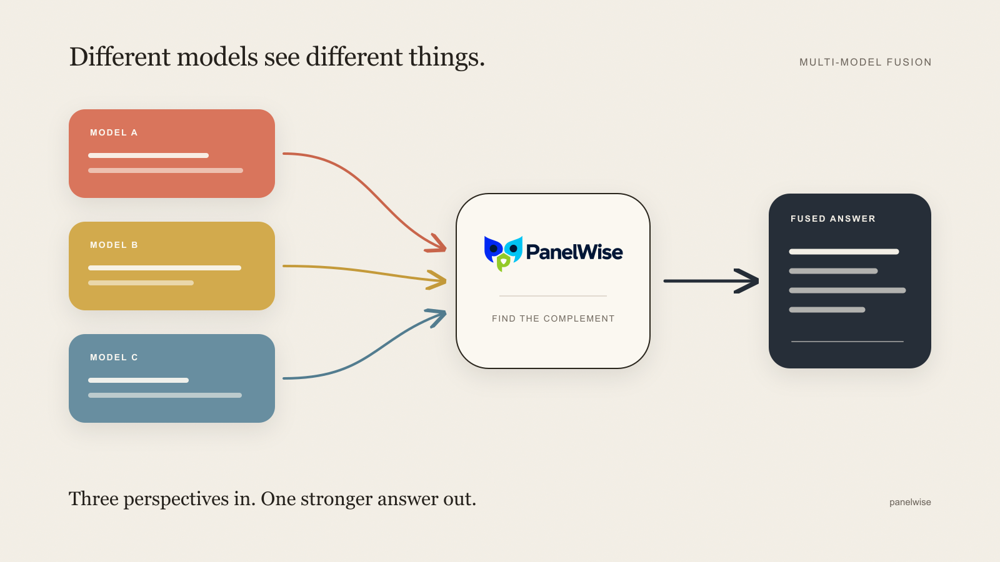
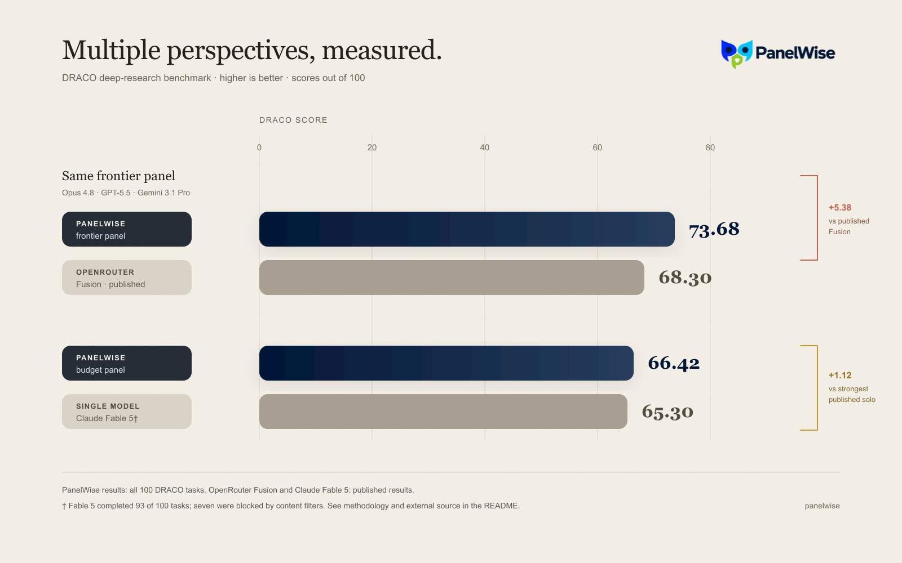

<p align="center">
  
</p>

<p align="center">
  <strong>English</strong> · <a href="./README.zh-CN.md">中文</a>
</p>

<p align="center">
  <a href="https://github.com/inclusionAI/PanelWise/actions/workflows/ci.yml"></a>
  <a href="./LICENSE"></a>
  
</p>

# PanelWise

**Fuse the complementary strengths of multiple models into one stronger result.**

PanelWise starts with a simple question: if every model sees something worth keeping, can their complementary judgments produce a result stronger than any one answer? It is an embeddable Python aggregation engine that sends the same task to a configurable panel, preserves each model's distinct contribution, and coordinates those contributions through one of two execution topologies. The task itself is unrestricted; prompts, providers, and environment adapters define the domain.

<p align="center">
  
</p>

## Two modes, one interface

| Mode | Topology | Best fit |
|---|---|---|
| `--eval` | independent complete attempts → evaluator → synthesis | Answer-centric tasks, including deep research |
| `--no-eval` | independent next-action proposals → one coordinated action → shared observable state → repeat | Stateful tasks, including coding |

These are execution modes, not hard-coded task categories. Both accept any task string. Custom `ChatClient` and `Executor` implementations can connect the same engine to another provider or environment.

```bash
panelwise run "Compare PostgreSQL and MySQL for a large marketplace" --eval
panelwise run "Fix the parser regression and run focused tests" --no-eval --workspace ./project
```

`--eval` and `--no-eval` override one YAML value, so applications can switch topology without changing code or duplicating configuration.

## Install

PanelWise requires Python 3.10 or newer.

```bash
git clone https://github.com/inclusionAI/PanelWise.git
cd PanelWise
python3 -m venv .venv
.venv/bin/python -m pip install .
```

Install a pinned Git revision directly:

```bash
python3 -m pip install "panelwise @ git+https://github.com/inclusionAI/PanelWise.git@main"
```

Replace `main` with a release tag or commit SHA when reproducibility matters. Contributors should use `python -m pip install -e '.[dev]'`.

## Five-minute start

Create a documented configuration and validate it without making model calls:

```bash
panelwise init
export OPENROUTER_API_KEY="..."
panelwise validate --config panelwise.yaml
```

The generated YAML contains provider, model-role, concurrency, timeout, workspace, and prompt settings. The same file drives both modes:

```yaml
version: 1

provider:
  name: openrouter
  api_key_env: OPENROUTER_API_KEY

models:
  panel: [z-ai/glm-5.1, minimax/minimax-m3, qwen/qwen3.7-max]
  coordinator: z-ai/glm-5.1
  evaluator: z-ai/glm-5.1

execution:
  eval: true
  concurrency: 3
  max_steps: 24
  workspace: .
```

See the full [`panelwise.example.yaml`](./panelwise.example.yaml) and [configuration reference](./docs/configuration.md).

## Python library

```python
import asyncio
from panelwise import PanelWise

async def main():
    async with PanelWise.from_yaml("panelwise.yaml", eval=True) as engine:
        result = await engine.run(
            "Compare the strongest arguments for and against carbon taxes.",
            request_id="example-1",
        )

    if result.ok:
        print(result.output)
    else:
        print(result.status, result.errors)

asyncio.run(main())
```

`PanelWiseResult` has one stable contract across both modes. It always includes `request_id`, `mode`, `status`, `output`, `usage`, and `errors`. Eval mode additionally returns independent `candidates` and structured `evaluation`; no-eval mode returns the shared `trajectory` and executor `artifacts`, including a Git patch when available.

Individual panel failures are isolated. Invalid configuration raises a documented `PanelWiseError` subclass; it never terminates the host process with `SystemExit`. See the [Python API and failure contract](./docs/api.md).

## Results on DRACO

We evaluated PanelWise on all 100 tasks in [DRACO](https://arxiv.org/abs/2503.14476), a deep-research benchmark spanning ten domains. Each task is scored against a weighted rubric covering factual accuracy, breadth, depth, presentation, and citation quality.

<p align="center">
  
</p>

The **OpenRouter Fusion score of 68.3** and **Claude Fable 5 score of 65.3** are both quoted from [OpenRouter's official Fusion launch post](https://openrouter.ai/blog/announcements/fusion-beats-frontier/). PanelWise scores come from our complete 100-task evaluation runs.

| System | Models | DRACO score |
|---|---|---:|
| **PanelWise frontier panel** | Opus 4.8 + GPT-5.5 + Gemini 3.1 Pro | **73.68** |
| OpenRouter Fusion, published comparison | Opus 4.8 + GPT-5.5 + Gemini 3.1 Pro | 68.3 |
| **PanelWise budget panel** | GLM 5.1 + MiniMax M3 + Qwen 3.7 Max | **66.42** |
| Strongest published single-model baseline | Claude Fable 5 | 65.3 |

The frontier panel scored **5.38 points above** the published Fusion result using the same three participant models. The independent budget run scored **1.12 points above** the strongest published single-model baseline. OpenRouter reports Fable 5 over 93 completed tasks because content filters blocked seven tasks, so that comparison is slightly uneven.

The benchmark supports a claim about deep-research aggregation on DRACO; it is not a claim that every task or model panel improves.

## Providers and extension points

The built-in async client supports:

- OpenRouter;
- ZenMux;
- any OpenAI-compatible chat-completions base URL.

Provider-specific request fields can be supplied through YAML. A custom provider implements the small `ChatClient` protocol. A custom shared environment implements `Executor`, allowing no-eval mode to coordinate a shell, container, browser, database, simulator, or remote worker without changing the aggregation engine.

Trajectory mode's built-in local shell executor rejects obvious destructive commands, enforces time and output bounds, and starts every action in one configured workspace. It is a guardrail, not a sandbox; untrusted tasks belong in a disposable container or VM.

## Documentation

- [CLI reference](./docs/cli.md)
- [Configuration and provider setup](./docs/configuration.md)
- [Python API and result contract](./docs/api.md)
- [Examples](./examples)
- [Troubleshooting](./docs/troubleshooting.md)
- [Release process](./docs/releasing.md)
- [Contributing and pull request requirements](./CONTRIBUTING.md)
- [Security policy](./SECURITY.md)
- [Changelog](./CHANGELOG.md)

## Development

```bash
python3.12 -m venv .venv
.venv/bin/python -m pip install -e '.[dev]'
.venv/bin/ruff check src tests examples
.venv/bin/python -m unittest discover -s tests -v
.venv/bin/python -m build
```

The test suite is offline and requires no model key. Public API, provider, executor, and architectural changes should begin with an issue; focused documentation fixes may go directly to a PR. Every behavior change must include reproducible verification. See [CONTRIBUTING.md](./CONTRIBUTING.md).

## Contributors

<p>
  <a href="https://github.com/jcguo123"></a>
  <a href="https://github.com/DPLL"></a>
</p>

Contributors are displayed in the order defined in [CONTRIBUTORS.md](./CONTRIBUTORS.md).

## License

PanelWise is available under the [Apache License 2.0](./LICENSE).
