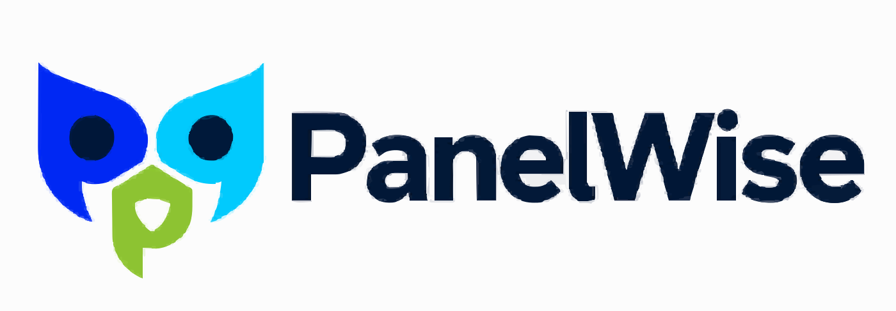

<p align="center">
  
</p>

<p align="center">
  <a href="./README.md">English</a> · <strong>中文</strong>
</p>

<p align="center">
  <a href="https://github.com/inclusionAI/PanelWise/actions/workflows/ci.yml"></a>
  <a href="./LICENSE"></a>
</p>

# PanelWise

**融合多个模型彼此互补的优势，得到一个更强、可验证的结果。**

PanelWise 的出发点是一个简单的问题：既然每个弱模型的回答都有自己的可取之处，我们能否融合这些回答中互补的部分，让最终结果超过更强的单一模型？PanelWise 让多个模型独立观察同一个问题，提出不同的分析或下一步行动；随后将这些判断组织成一条共享、可执行的工作轨迹，并把最终结果交给独立 grader 验证。

PanelWise 将这一思想应用于两类工作流：

- **深度研究：**多个研究 agent 独立调查同一个问题，judge 识别共识与盲区，synthesizer 生成一份基于证据的最终报告。
- **软件工程：**多个 agent 针对同一个真实仓库状态提出下一步行动，PanelWise 融合并执行其中一个行动，下一轮再继续观察执行后的结果。

## 工作原理

### 深度研究

```text
一个研究问题
        ↓
N 个独立研究 agent
        ↓
共识 · 矛盾 · 独特证据 · 盲区
        ↓
一份融合后的最终报告
        ↓
独立 rubric grader
```

每个研究 agent 都运行自己的多步 ReAct 循环，自主搜索并读取网页。PanelWise 可以保留研究轨迹，对报告进行结构化比较，并让最终答案建立在 panel 收集的证据之上。

### 软件工程

```text
任务说明 + 真实仓库
        ↓
多个模型分别提出下一步行动
        ↓
PanelWise 融合并执行一个行动
        ↓
生成下一轮共享的仓库状态
        ↓
Git patch → 独立测试 harness
```

代码工作流直接操作真实 working tree，而不是让模型凭空想象一整份 diff。因此，模型能够根据实际源码、命令输出、之前的修改和测试结果继续行动。最终 patch 直接来自 `git diff`，并可交给 benchmark 的原生 harness 验证。

## DRACO 结果

我们在 [DRACO](https://arxiv.org/abs/2503.14476) 的全部 100 个任务上评测了 PanelWise。DRACO 是一个覆盖十个领域的深度研究 benchmark，每道题都通过加权 rubric 评估事实准确性、广度、深度、表达与引用质量。

| 系统 | 模型 | DRACO 分数 |
|---|---|---:|
| **PanelWise 前沿组合** | Opus 4.8 + GPT-5.5 + Gemini 3.1 Pro | **73.68** |
| OpenRouter Fusion 公开结果 | Opus 4.8 + GPT-5.5 + Gemini 3.1 Pro | 68.3 |
| **PanelWise 轻量组合** | GLM 5.1 + MiniMax M3 + Qwen 3.7 Max | **66.42** |
| 公开结果中最强的单模型基线 | Claude Fable 5 | 65.3 |

PanelWise 前沿组合比 OpenRouter 公开的同三模型组合高 **5.38 分**。完整独立运行的轻量组合比公开结果中最强的单模型基线高 **1.12 分**。

OpenRouter 的 Fable 5 分数来自它实际完成的 93 个任务；另外 7 个任务被内容过滤器拦截。

一项 panel-swap 消融实验将 Qwen 替换为 Gemini 3.5 Flash，得到 **70.95**。该实验复用了已有的 GLM 和 MiniMax 报告，因此我们将它作为“模型多样性可能比单模型排名更重要”的证据，而不把它描述为一次完全独立的端到端运行。

数据来源：[`frontier_fusion_official.json`](./results/frontier_fusion_official.json)、[`frontier_fusion_ourjudge.json`](./results/frontier_fusion_ourjudge.json)、[`budget_fusion_glm_minimax_qwen.json`](./results/budget_fusion_glm_minimax_qwen.json)、[`budget_swap_geminiflash.json`](./results/budget_swap_geminiflash.json)，以及 [OpenRouter 公开的 DRACO 结果](https://openrouter.ai/blog/announcements/fusion-beats-frontier/)。

## 一个真实代码案例：融合多个小模型的智慧

我们还在 SWE-Bench Pro 的 **“Proper WebFinger Response for Instance Actor”** 任务上测试了同一个思想：

```text
instance_NodeBB__NodeBB-da0211b1a001d45d73b4c84c6417a4f1b0312575-vf2cf3cbd463b7ad942381f1c6d077626485a1e9e
```

NodeBB 已经能够通过 WebFinger 解析普通用户，却不能把站点自身正确解析为 ActivityPub Application actor。一份有效修复必须同时修改两个 controller，并保留原有用户路径的行为：

1. 使用不含端口的 `hostname` 作为 Application actor 的 `preferredUsername`，并使用配置的站点标题作为显示名称。
2. 使用可能包含端口的 `host` 验证 WebFinger 地址，但使用 `hostname` 识别 instance actor。
3. 在普通用户权限检查和 UID 查询之前处理 instance actor。
4. 为普通用户保留规范 userslug、profile link、UID actor link、权限检查与 404 行为。

GLM 5.1、MiniMax M3 和 Qwen 3.7 Max 各自找到了部分正确方向，但遗漏点并不相同：一个混淆了 `host` 与 `hostname`，一个把 instance discovery 留在用户权限检查之后，另一个修复了 instance 路径却保留了非规范的普通用户链接。PanelWise 将这些局部判断带入同一条共享执行轨迹，最终收敛为一份同时修改两个 controller 的完整修复。

这个案例的关键在于连续发生的纠正：先定位两个协议入口，再分离地址验证与 actor 身份，随后把 instance 路径移到用户逻辑之前，重新检查普通用户兼容性，最后对齐 Application actor 的表示。

## 快速开始

### 环境要求

- 推荐 Python 3.11；核心包也可在 Python 3.9 上运行
- OpenRouter 或 ZenMux API key
- 使用默认直连搜索后端时需要 Exa API key
- 进行代码评测时需要 Docker 和 SWE-Bench Pro harness

### 安装

```bash
git clone https://github.com/inclusionAI/PanelWise.git
cd PanelWise

python3.11 -m venv .venv
.venv/bin/pip install -r requirements.txt
cp .env.example .env
```

在 `.env` 中设置 `OPENROUTER_API_KEY` 和 `EXA_API_KEY`。如需使用 ZenMux，请设置 `MODEL_PROVIDER=zenmux`，添加 `ZENMUX_API_KEY`，并保持 `RESEARCH_SEARCH_BACKEND=exa`。

### 在不发起外部调用的情况下验证配置

```bash
.venv/bin/python fusion_full.py --dry-run
```

Dry run 只检查本地配置，不会加载 benchmark 数据、调用模型或搜索服务、运行 grader，也不会创建输出。

### 运行一个深度研究任务

```bash
.venv/bin/python fusion_full.py --limit 1
```

结果会增量写入 `output/`，中断后可以继续运行。

### 运行完整深度研究评测

```bash
.venv/bin/python fusion_full.py
```

## Python API

PanelWise 既可接收 prompt 字符串，也可接收 provider-compatible 的消息数组：

```python
from draco_eval.fusion import run_fusion_messages

result = await run_fusion_messages(
    client,
    [
        {"role": "system", "content": "Use concise citations."},
        {"role": "user", "content": "Compare the strongest arguments for and against carbon taxes."},
    ],
    panel_models=["model-a", "model-b", "model-c"],
    synth_model="model-d",
    judge_model="model-e",
    excluded_domains=[],
    request_id="request-1",
)
```

稳定的消息接口包括：

- `draco_eval.fusion.run_fusion_messages`
- `draco_eval.research_agent.run_research_messages`

以下划线开头的辅助函数属于内部实现细节。

## 仓库结构

```text
draco_eval/
  research_agent.py    支持搜索与网页读取的多步研究 agent
  fusion.py            研究 panel → 结构化分析 → 最终融合
  judge.py             本地 DRACO grader
  official_judge.py    可选官方 rubric grader 的适配器

fusion_full.py         受支持的完整 DRACO 工作流
results/               已提交的聚合实验结果
```

仓库根目录的消融与比较脚本为研究透明度而保留。它们可能依赖历史模型 slug、可选服务或中间产物，不属于稳定公共接口。

## 评测与复现说明

- 已提交的 JSON 文件保留聚合分数、模型名称、样本数和领域明细，不包含原始题目、逐题报告、完整轨迹或完整运行 manifest。
- 外部数字仅作为已注明出处的公开比较点。模型快照、搜索配置、grader 版本和重试策略的差异都可能影响绝对可比性。
- `requirements.txt` 包含核心运行依赖。可选的官方 grader 单独固定在 `requirements-eval.txt` 中，并要求 Python 3.10 或更高版本。
- 可信本地研究运行默认启用直接网页读取。设置 `RESEARCH_ENABLE_DIRECT_FETCH=0` 可关闭此功能；该开关是 opt-out，不是 SSRF sandbox。

## 许可证

PanelWise 使用 [Apache License 2.0](./LICENSE)。初始贡献者见 [CONTRIBUTORS.md](./CONTRIBUTORS.md)。
